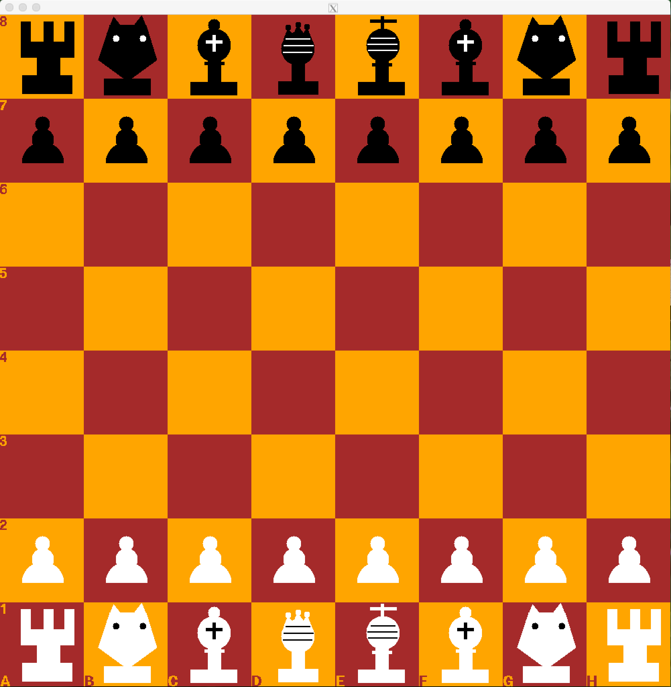

# Chess
Built a 4-level chess engine in C++ <br>

Code access is private due to course restrictions.

GUI using Xwindow:



## Playing 

The exectuable is provided and will only run on a linux machine
```
$ ./chess 

and follow the questions on the screen
```
